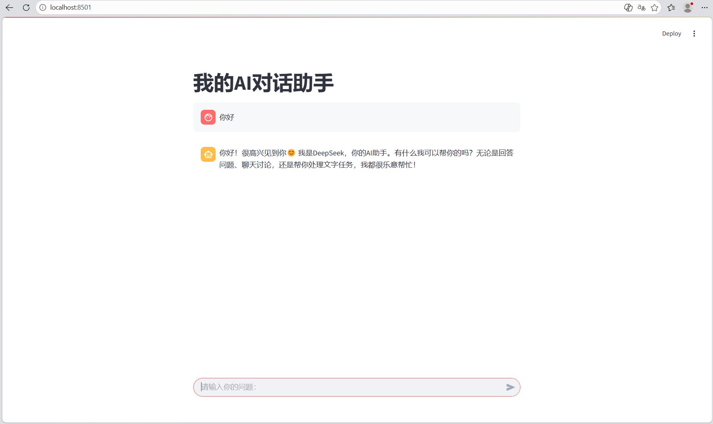

## 项目演示


## 项目列表
1. 智能文档摘要工具 (summarize.py)
2. 智能问答机器人 (chat_bot.py)
3. Web智能对话应用 (app.py) - 基于Streamlit的网页版AI对话
---

# 智能文档摘要工具

基于 Python 实现的文本自动摘要工具，支持按句子切分并提取前 N 句作为摘要。

## 功能
- 输入一段文本，输出三句话摘要
- 纯 Python 实现，无需额外依赖

## 运行方式
```bash
python summarize.py
```
# 智能问答机器人

基于 Python 实现的智能问答机器人，调用 DeepSeek API 实现对话。

## 功能
- 输入问题，输出回答
- 调用 DeepSeek API 获取回答

## 运行方式
```bash
python chat_bot.py
```