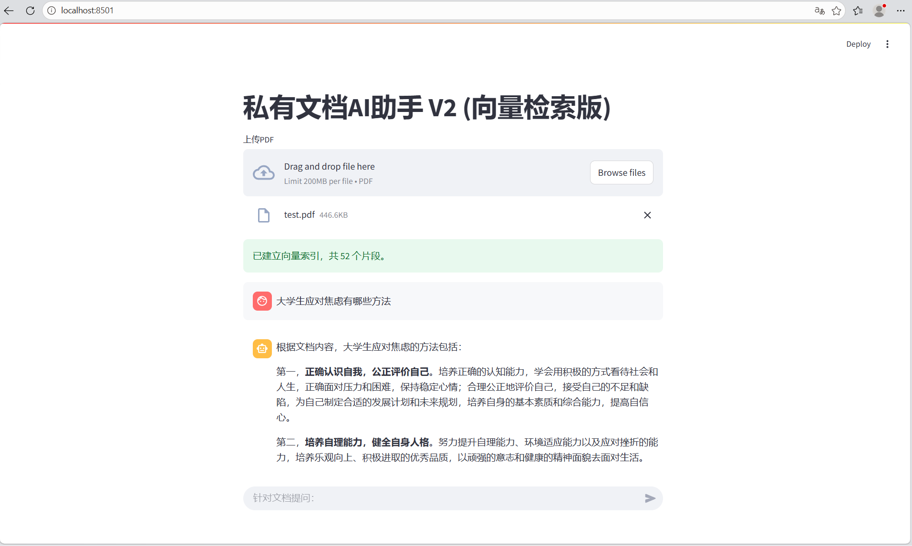

# 我的AI学习项目集

## 项目列表
1. **Agentic RAG 私有知识库助手** (agent_rag.py) - 基于 Function Calling 的自主检索 Agent，能判断是否查文档，带页码引用，支持离线运行
2. **私有文档AI助手 V2** (rag_app_v2.py) - 基于向量检索的 RAG 系统，ChromaDB + HuggingFace 本地模型，完全离线
3. **Web智能对话应用** (app.py) - 基于 Streamlit 的网页版 AI 对话
4. **智能问答机器人** (chat_bot.py) - 调用 DeepSeek API 实现对话
5. **智能文档摘要工具** (summarize.py) - 纯 Python 实现文本摘要

## 项目演示




## 技术栈
Python、Streamlit、LangChain、ChromaDB、HuggingFace（bge-small-zh-v1.5）、DeepSeek API、Function Calling、PyPDF、python-dotenv、Git

## 运行方式
```bash
pip install -r requirements.txt
streamlit run agent_rag.py
---

# 智能文档摘要工具

基于 Python 实现的文本自动摘要工具，支持按句子切分并提取前 N 句作为摘要。

## 功能
- 输入一段文本，输出三句话摘要
- 纯 Python 实现，无需额外依赖

## 运行方式
```bash
python summarize.py
```
# 智能问答机器人

基于 Python 实现的智能问答机器人，调用 DeepSeek API 实现对话。

## 功能
- 输入问题，输出回答
- 调用 DeepSeek API 获取回答

## 运行方式
```bash
python chat_bot.py
```