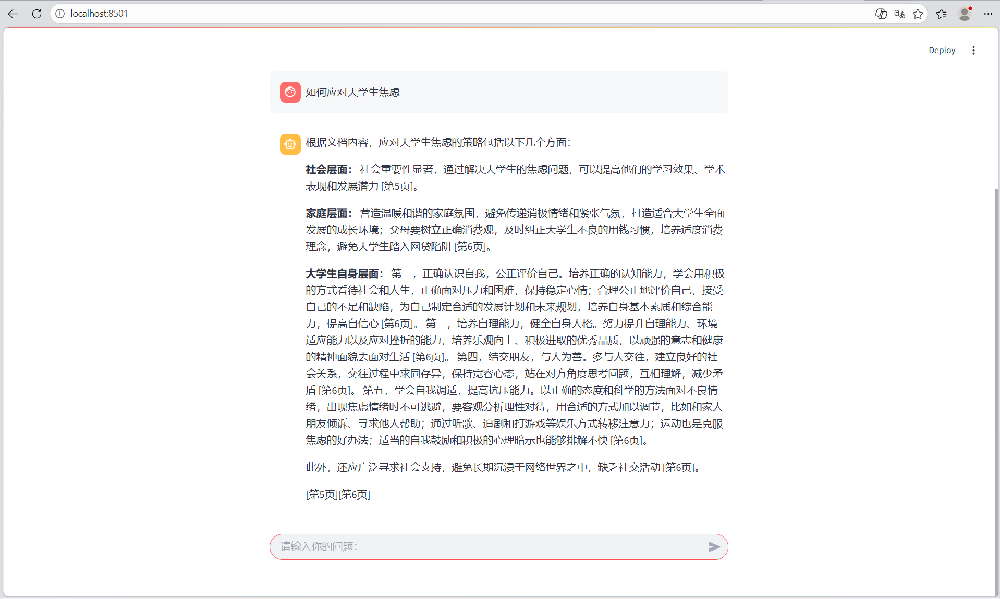
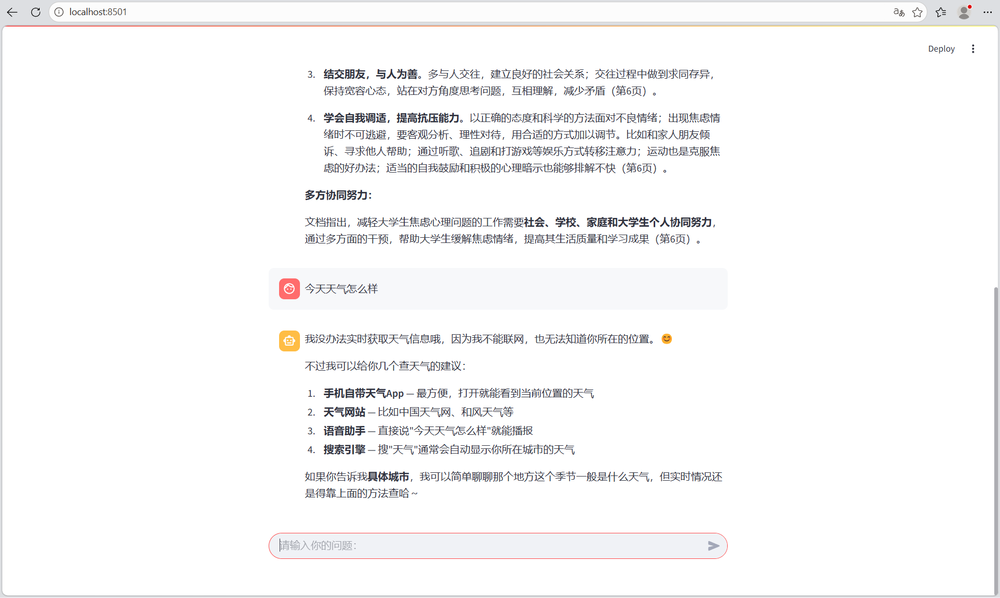

# 我的AI学习项目集

## 核心项目
1. **Agentic RAG v2 - 带质量审核和自动重试** (`agent_rag_v2.py`) - 基于 **LangGraph** 状态机实现“意图识别 → 检索 → 生成 → 质量审核 → 自动重试”的完整 Agent 工作流，支持页码引用、FastAPI 接口、SSE 流式输出和 Docker 部署。
2. **Agentic RAG v1** (`agent_rag.py`) - 基于 Function Calling 的自主检索 Agent，能自动判断是否查文档。
3. **私有文档AI助手 V2** (`rag_app_v2.py`) - 基于向量检索的 RAG 系统（ChromaDB + HuggingFace）。
4. **Web智能对话应用** (`app.py`) - 基于 Streamlit 的网页版 AI 对话。
5. **智能文档摘要工具** (`summarize.py`) - 纯 Python 实现文本摘要。

## 项目演示
**Agentic RAG v2：带页码引用与质量审核**


**Agentic RAG v1：Function Calling 路由**


## 技术栈
Python、Streamlit、LangGraph、LangChain、ChromaDB、HuggingFace (bge-small-zh-v1.5)、DeepSeek API、FastAPI、SSE、Docker、Function Calling、PyPDF、python-dotenv、Git

## 工程亮点（面试可讲）
- **Agent 自主决策**：通过 LangGraph 构建状态机，意图识别节点默认强制走检索，避免大模型用通用常识绕过文档。
- **质量审核与自动重试**：如果生成的回答未包含 `[第X页]` 格式的引用，系统自动触发重试，将 Top-K 从 8 增至 15，最多重试 3 次。
- **工程化封装**：使用 **FastAPI** 封装 RESTful API（`POST /ask`），实现前后端解耦；支持 **SSE 流式输出**（`POST /ask/stream`），首字延迟从 5 秒降至 0.3 秒。
- **Docker 容器化部署**：编写 Dockerfile，实现一键启动、环境隔离、跨平台运行。
- **完全离线运行**：使用 HuggingFace 本地嵌入模型，配合 `HF_ENDPOINT` 国内镜像，无需联网且保护隐私。
- **真实踩坑记录**：解决了 API 欠费、SSL 证书、编码乱码、检索遗漏（4.2 内容）、Streamlit 与 PyTorch 环境冲突等问题。
- **混合检索**：BM25 关键词召回 + 向量语义召回，通过 RRF（Reciprocal Rank Fusion） 融合两路结果，再经 Reranker（bge-reranker-base） 精排，解决单一向量检索在专有名词、数字等场景下的召回不足问题。
- **多工具 Agent路由** ：基于 LangGraph 的意图识别节点，自动判断用户问题类型。文档问题走 RAG 检索（混合检索 + Reranker 精排，带页码引用），数据统计问题走 Text-to-SQL（自动生成 SQL 查询 SQLite 数据库），实现“一问多能”的企业级 Agent 系统。

## 评估结果与分析
构建了包含5个场景的自动化评估集（`eval_set.json`），通过 `evaluate.py` 实现批量测试与命中率统计，**当前检索命中率达 80%**。

**评估结果分析**：发现模型在回答“如何提高心理承受能力”时，虽然逻辑正确，但表述与预设关键词不完全匹配。后续可通过引入语义相似度（如 RAGAS 框架）或扩大关键词匹配范围来优化评估准确性。

## 运行方式

### 方式一：本地运行（需配置 Python 环境）
```bash
pip install -r requirements.txt
# 启动 FastAPI 服务
uvicorn server:app --port 8000
# 浏览器打开 http://127.0.0.1:8000/docs 进行接口测试
```

### 方式二：Docker 部署（推荐，一键启动）
```bash
# 构建镜像
docker build -t rag-api .
# 运行容器（需确保当前目录有 test.pdf 和 .env 文件）
docker run -p 8000:8000 --env-file .env -v "%cd%/test.pdf:/app/test.pdf" -v "%USERPROFILE%/.cache/huggingface:/root/.cache/huggingface" rag-api
启动后打开 http://127.0.0.1:8000/docs 即可测试接口。
```